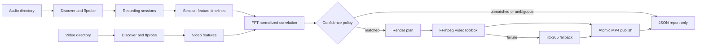

# 아키텍처와 알고리즘

## 전체 데이터 흐름



CLI와 다른 애플리케이션은 `pipeline.py` 또는 `api.py`를 호출한다. 순수한 세션·매칭
정책은 외부 프로세스를 모르며, `media.py`와 `render.py`만 FFmpeg 및 파일 시스템을
다룬다.

## 모듈 책임

| 모듈 | 책임 | 주요 공개 경계 |
|---|---|---|
| `models.py` | 불변 도메인 모델과 상태 | `AudioChunk`, `RecordingSession`, `AudioMatch` |
| `sessions.py` | 자연 정렬과 녹음 세션 분리 | `group_recording_sessions()` |
| `matching.py` | 특징 생성, FFT NCC, confidence, drift | `match_video_features()` |
| `media.py` | 파일 탐색, ffprobe, PCM/특징 추출 | `FFmpegTools`, `VideoInfo` |
| `render.py` | concat 매니페스트, FFmpeg 명령, 원자적 출력 | `RenderPlan`, `FFmpegRenderer` |
| `report.py` | 버전 있는 JSON 계약 | `MatchReport` |
| `pipeline.py` | 디렉터리 단위 분석·처리 orchestration | `RecorderSyncPipeline` |
| `api.py` | TubeArchive 등 외부 소비자를 위한 얇은 API | `discover_sessions()`, `match_videos()` |
| `cli.py` | argparse, 출력, 종료 코드 | `main()` |

의존 방향은 CLI/API → pipeline/domain → media/render다. 매칭 도메인이 CLI나
subprocess를 import하는 역방향 의존성을 만들지 않는다.

## 세션 구성

지원 오디오만 입력 디렉터리 바로 아래에서 찾고 자연 파일명 순서를 적용한다. CLI의
`--audio-dir`를 생략하면 오디오 입력 디렉터리는 `VIDEO_DIR`와 같다.
`ffprobe` 메타데이터와 파일 시스템 시각의 우선순위는 다음과 같다.

1. format 또는 audio stream의 `creation_time`
2. macOS `st_birthtime`
3. `st_mtime`
4. 같은 시각에서는 자연 파일명

인접 조각의 sample rate, channel 수, codec이 다르면 새 세션이다. 앞 조각의 예상
종료보다 다음 조각이 `--session-gap-seconds` 이상 늦게 시작해도 새 세션이다.
복사 과정에서 모든 파일 시각이 같아질 수 있으므로 음수 gap은 새 세션으로 보지 않고
자연 파일명 순서를 신뢰한다.

각 조각 특징의 프레임 수는 `duration / 0.05초`에 맞춰 trim 또는 마지막 프레임
padding을 한다. 이를 생략하면 조각 경계마다 약 50ms가 누적되어 뒤쪽 클립의 offset이
틀어질 수 있다.

## 오디오 특징

FFmpeg가 첫 오디오 스트림을 8kHz mono `f32le` PCM으로 디코딩한다. 100ms frame,
50ms hop을 사용해 다음 6개 대역의 log-energy를 계산한다.

```text
80-200, 200-400, 400-800, 800-1600, 1600-3200, 3200-4000 Hz
```

각 대역은 평균 0과 표준편차 1로 정규화한다. 긴 조각에서 거대한 STFT 행렬을 한 번에
복사하지 않도록 4096 frame 블록으로 FFT를 계산한다.

## 매칭과 confidence

각 대역은 SciPy의 FFT correlation을 사용한다. numerator만 비교하지 않고 모든
슬라이딩 구간의 합과 제곱합으로 local variance를 구해 normalized
cross-correlation(NCC)을 계산한다. 이는 긴 세션의 전체 음량 분산이 특정 구간 점수를
왜곡하는 문제를 막는다.

최고 peak 주변 기본 1초를 제외한 뒤 차순위 peak를 찾는다. 영상 전체 길이를 제외하면
서로 겹치지만 실제로 다른 반복 음악 구간을 놓칠 수 있으므로 제외 반경을 늘리지 않는다.

```text
correlation_score = clamp((best_correlation + 1) / 2, 0, 1)
margin_score      = clamp(peak_margin / 0.15, 0, 1)
confidence        = 0.7 * correlation_score + 0.3 * margin_score
```

기본 승인 기준은 confidence 0.75 이상, peak margin 0.05 이상이다.

- 상관도 자체가 약하면 `unmatched`
- 강한 후보가 있지만 차순위와 구분되지 않으면 `ambiguous`
- 두 기준을 모두 통과하면 `matched`

상태 판정 순서와 수식은 공개 JSON 소비자에게 영향을 주므로 변경 시 테스트, 문서,
REPORT_VERSION 호환성을 함께 검토한다.

## 정밀 시작점과 clock drift

30초 미만 클립은 coarse offset을 그대로 사용한다. 긴 클립은 앞뒤 특징 창을 coarse
위치 주변 기본 ±5초에서 다시 검색한다. 앞 창과 뒤 창의 외부 span을 영상 span으로
나눈 값이 `tempo_ratio`다.

```text
tempo_ratio = external_feature_span / video_feature_span
```

FFmpeg `atempo`에 그대로 전달하므로 1보다 크면 외부 음원을 빠르게 재생한다. 현재
허용 범위는 FFmpeg 단일 `atempo`가 처리할 수 있는 0.5~2.0이다.

## 렌더링

세션 조각은 절대 경로를 사용한 임시 concat demuxer 매니페스트로 연결한다. 상대
경로를 사용하면 임시 매니페스트 디렉터리를 기준으로 해석되므로 금지한다.

| 항목 | 값 |
|---|---|
| 컨테이너 | MP4 |
| 해상도 | 회전 메타데이터 적용 후 원본 표시 해상도 |
| frame rate | 원본 프레임 타임스탬프와 VFR 보존 |
| 영상 | `hevc_videotoolbox`, 50Mbps, `p010le`, `hvc1` |
| 색공간 | BT.709 SDR, TV range |
| 오디오 | AAC 48kHz 256kbps |
| 폴백 | `libx265`, `yuv420p10le`, preset medium |

FFmpeg 기본 autorotate가 스마트폰의 display matrix를 실제 픽셀 방향에 적용한다.
렌더 필터는 `scale`, `pad`, `crop`, 배경 `overlay`를 사용하지 않으므로 1080×1920 세로
입력은 1080×1920, 3840×2160 가로 입력은 3840×2160으로 출력된다. HLG/PQ 입력은
TubeArchive와 같은 `colorspace=all=bt709:iall=bt2020:dither=fsb` 필터를 사용한다.
`zscale`은 기본 Homebrew FFmpeg 구성에 없을 수 있으므로 의존하지 않는다.

고정 `-r` 대신 `-fps_mode:v passthrough`를 사용한다. 따라서 24/25/30/60fps와 스마트폰
VFR의 프레임 타임스탬프를 임의 CFR로 변환하지 않는다. 오디오의 drift 보정과 출력
길이 제한은 기존 `atempo`, `atrim` 정책을 그대로 적용한다.

렌더는 숨김 임시 파일에 먼저 쓰고 성공한 뒤 최종 경로로 원자적으로 이동한다.
VideoToolbox가 실패하면 임시 파일을 제거하고 libx265로 재시도한다. 최종 파일이 이미
있으면 `--overwrite` 없이는 시작하지 않는다.

## 리포트 국제화

리포트의 JSON 키, 상태, 수치 필드는 언어와 무관한 자동화 계약이다. `language`은
사람이 읽는 `reason`의 언어를 나타내며 `ko/en`만 지원한다. 번역은 직렬화 경계에서만
수행하므로 내부 매칭·오류 사유는 안정적인 영어 원문을 유지한다. 알 수 없는 FFmpeg
진단은 정보 손실을 막기 위해 번역하지 않는다.

## 오류와 자동화 계약

- `0`: 모든 영상이 `matched`이고 필요한 렌더가 성공
- `1`: 입력 디렉터리, 세션 분석 등 배치 전체를 진행할 수 없는 치명적 실패
- `2`: 배치는 완료했지만 하나 이상 `unmatched`, `ambiguous`, `error`

개별 영상의 probe/특징/렌더 실패는 가능한 경우 다른 영상을 계속 처리하고 JSON의
`error`로 남긴다. 원본은 항상 읽기 전용이다.

## 성능 기준

`scripts/benchmark_matcher.py`가 12시간 특징 타임라인과 60초 영상 200개를 생성한다.
2026-07-17 Apple Silicon 측정값은 총 약 31.7초, 영상당 p95 0.159초, p99 0.160초,
peak RSS 약 322MB였다. 기준은 총 600초와 2GB다. 숫자를 갱신할 때 하드웨어와 날짜를
함께 기록한다.
